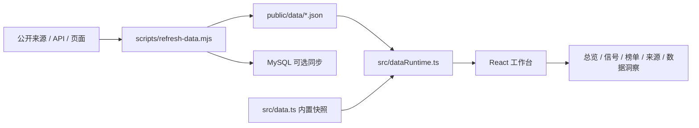

# 系统总览

更新时间：2026-06-30

## 当前定位

AI 前沿情报站是一个多源 AI 情报工作台。它不是普通信息卡片站，也不是单纯榜单站，而是把官方确认、能力榜单、生态热度、早期传播和来源健康统一成可验证的信号系统。

当前仓库实现仍保留少量旧兼容命名：

- `RadarDataset`
- `radar-data.json`
- `#radar`

这些是历史兼容名称。后续用户可见产品、文档和 UI 方向统一为：

- 产品名：`AI 前沿情报站`
- 英文名：`Frontier Intel`
- 首页：`情报总览`
- 核心模块：`信号矩阵`

## 当前系统结构

## 前端入口

| 文件 | 作用 |
| --- | --- |
| `src/main.tsx` | 应用启动入口；默认进入工作台，`/?landing` 进入 Landing 页面 |
| `src/App.tsx` | 当前直接导出工作台应用 |
| `src/FrontierIntelApp.tsx` | 当前主工作台实现，包含页面路由、搜索、筛选、详情抽屉和状态汇总 |
| `src/styles/tokens.css`、`src/styles/frontier.css` | 情报站浅色主题 token 和工作台样式 |
| `src/dataRuntime.ts` | 优先读取 `/data/frontier-intel-data.json`，失败后兼容 `/data/radar-data.json`，每 60 秒轮询，最后保留内置快照 |
| `src/data.ts` | 内置 fallback 数据 |
| `src/types.ts` | 当前数据结构定义 |

## 当前页面能力

| 页面 | 当前能力 | 目标调整 |
| --- | --- | --- |
| 总览 | KPI、信号矩阵、信号详情、来源健康、刷新状态 | 持续强化来源覆盖和截图验收 |
| 前沿信号流 | 分类、可信度、来源类型、排序、搜索、详情抽屉 | 继续补充更多空态和失败态 |
| 模型地图 | 模型 KPI、榜单、信号、来源覆盖、评分维度 | 强化 OpenRouter、Artificial Analysis、LMArena、SWE-bench 来源 |
| Agent 市场 | Agent 榜单、能力标签、来源覆盖、关联信号 | 强化 Steel.dev、Agent Arena、HAL、SkillsBench 等来源 |
| Skill / 插件 | 工具 / 插件热度榜、MCP / Skill 信号、来源分布 | 继续细化能力分类 |
| 数据洞察 | 刷新任务、数据库状态、数据分栏、缺失密钥、过期状态 | 后续可补重试次数和失败率 |
| 榜单 | 综合、模型、Agent、工具、信号分段榜单 | 持续校准评分规则 |
| 发布日历 | 按窗口和可信度分组，低可信降权 | 增加更多来源事件类型 |
| 可信来源 | 来源目录、权重、授权方式、刷新 SLA、失败原因 | 后续可补来源覆盖率趋势 |
| 路线图 | 版本阶段、状态、受影响页面、下一步能力 | 与实施路线图持续同步 |

## 数据流

1. `scripts/refresh-data.mjs` 从官方页面、公开 API、榜单页面和可选密钥来源拉取数据。
2. 脚本将抓取结果写入 `sourceRuns` 和 `rawSnapshots`。
3. 脚本把原始结果归一化为 `signals`、`rankingItems`、`sourceHealth`、`dataPanels` 等前端数据。
4. 输出 JSON 到 `public/data/`。
5. 前端通过 `src/dataRuntime.ts` 优先读取 `frontier-intel-data.json`，旧部署可 fallback 到 `radar-data.json`，远程数据为空时使用 `src/data.ts` fallback。
6. UI 根据当前路由、分类、选中信号渲染不同页面。

## 当前 JSON 输出

| 文件 | 作用 |
| --- | --- |
| `public/data/frontier-intel-data.json` | 当前主数据集，Frontier Intel 目标命名 |
| `public/data/radar-data.json` | 历史兼容数据集，内容与主数据集保持一致 |
| `public/data/model-rankings.json` | 模型榜单面板数据 |
| `public/data/agent-rankings.json` | Agent 榜单面板数据 |
| `public/data/tool-rankings.json` | 工具 / 插件热度面板数据 |
| `public/data/source-runs.json` | 来源刷新运行记录 |
| `public/data/raw-snapshots.index.json` | 原始快照索引，不包含完整响应体 |

## 当前核心数据对象

| 类型 | 作用 |
| --- | --- |
| `FrontierSignal` | 单个前沿信号 |
| `SignalSource` | 信号证据来源 |
| `ReleaseFrame` | 发布时间窗口 |
| `RankingItem` | 榜单项 |
| `SourceHealth` | 来源健康状态 |
| `SourceRun` | 单次来源刷新运行记录 |
| `DataPanel` | 数据分栏 |
| `RoadmapItem` | 路线图 |

## 数据库

当前已有 MySQL schema 草案：

- `frontier_source_runs`
- `frontier_signals`
- `frontier_rankings`
- `provider_raw_snapshots`

后续更完整的数据模型建议参考 [data-sources.md](data-sources.md) 中的 `sources`、`entities`、`raw_events`、`rankings`、`signals`、`source_runs` 六张表。

## 当前差距

- 代码仍保留 `RadarDataset`、`radar-data.json` 和 `#radar` 作为兼容层，后续可在确认旧部署不再依赖后清理。
- 语言按钮仍是展示控件，暂未接入多语言状态。
- 来源健康已展示权重、SLA、失败和待配置状态，后续可继续补充失败率和重试次数。
- 榜单评分已有分层解释，后续需要继续按模型、Agent、工具三套评分规则校准权重。

## 文档关系

| 文档 | 作用 |
| --- | --- |
| `README.md` | 项目入口和运行说明 |
| `docs/system-overview.md` | 当前系统结构和实现状态 |
| `docs/data-sources.md` | 数据来源、评分、表结构和接入路线 |
| `docs/ui-information-architecture.md` | 目标信息架构和 UI 蓝图 |
| `docs/ui-blueprint.json` | 可被前端实现参考的结构化蓝图 |
